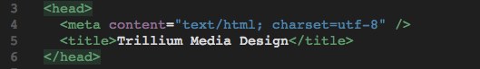
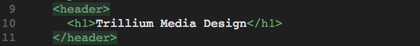
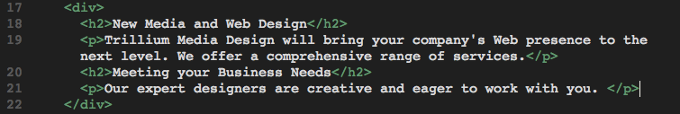
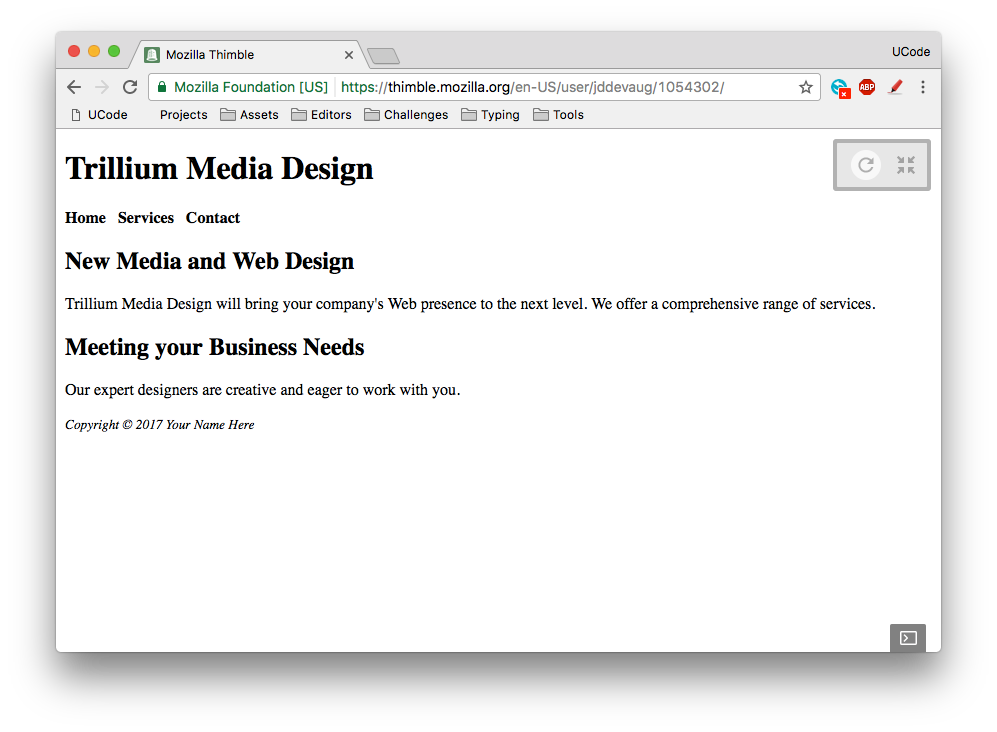

# Warmup Activity Day 1 

1. Clone this project to your local machine and open it in Atom.

2. Create a new file and save it as index.html. Take the [template.html](./template.html) file and replace the contents of the index.html file.

3. Modify the title of the web page [the text that appears in the tab] by changing the text between the `<title>` and `</title>` tags to `Trillium Media Design` like so: 

4. Position your cursor in the body section and code the header element with the text, "Trillium Media Design" in an h1 element element like so:  

5. Code a nav element to contain text that will indicate the main navigation for the website. Configure bold text using the b element and use the `&nbsp` special character (which stands for Nonbreaking space) to add extra blank space like so:  

6. Code the content within a div element that contains the h2 and paragraph elements. 

7. Configure the footer element to contain a copyright notice displayed in small font size and italic font. Be careful to properly nest the elements as shown here: 

Replace "Your Name Here" with your actual name. 

8. Compare your site to the below image and make any tweaks. To open the website you can open up your favorite browser go to File -> Open and find your index.html. You can also do it in Terminal by typing `open index.html` in the directory with the index.html file

## Done

Great job. Please make a commit and move on to [WarmupActivity Part II](../warmupActivityPartII)
