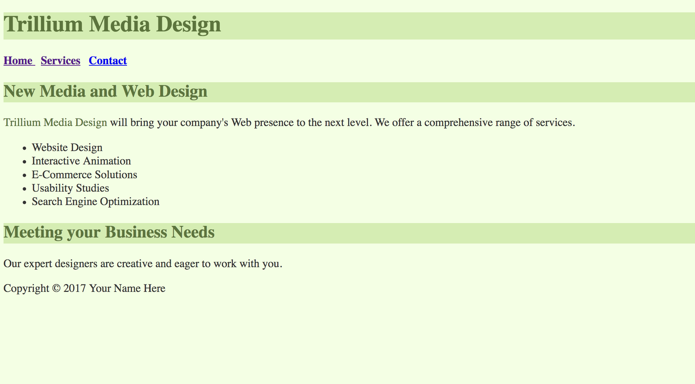
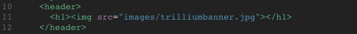
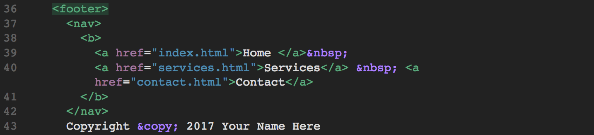
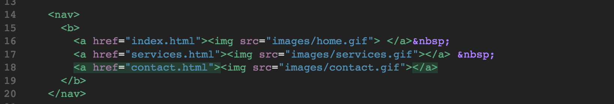
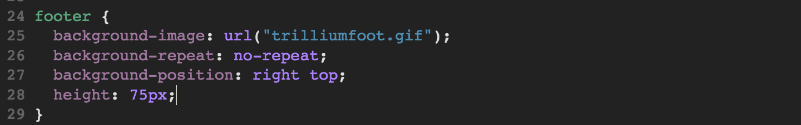
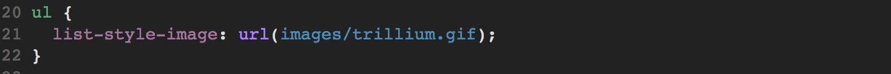
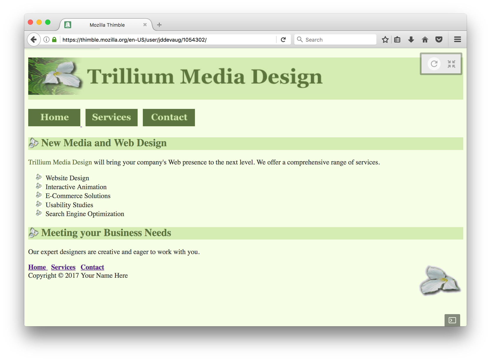

# Part 3 Warmup Activity

## Mini Challenge 

First start by tweaking your Trillium to site to look like this: 

The background color of the page is `#F4FFE4`  
The color of the text in the body of the page is `#333333` 
The background color of the headers are `#D5EDB3` 
The color of the text of the headers are `#5C743D` 
The company name color is also `#5C743D` 

Do the following:

1. Make sure you have an images folder.

2. remove all `<small><i>` tags from the footer of all html files and add css style rules to do that styling.

3. In your HTML, replace the h1 text with the `trilliumbanner.jpg`like so: 

4. In your CSS, add a [background image](https://www.w3schools.com/cssref/pr_background-image.asp), trilliumbg.gif, to the H2 elements vis the style definition in the stylesheet.
   You will need set it to not repeat. Add [left padding](https://www.w3schools.com/css/css_padding.asp) of 30px.
   

5. Copy the nav bar into the footer, above the Copyright line. **DO NOT** delete the nav bar at the top of the screen.

6. replace the navigation links **BELOW THE HEADER** with the images provided.

7. add the trulliumfoot.gif to the footer as a background image. Position it at the top right of the footer. Make the footer height be 75 pixels.

8. Add the favorites icon image link to each page. Put it between your `<head>` tags, right after the link to your CSS file.

9. change the list markers for the unordered lists on the contacts and index pages to use the trillium.gif image instead of the bullet points.

10. Your page should look like this now:

## DONE 

Great job! There's no Day 3 Challenge. You can move to the [Part 4 Warmup](../../part-IV)
