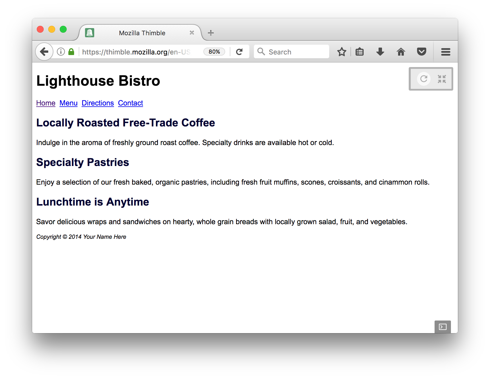
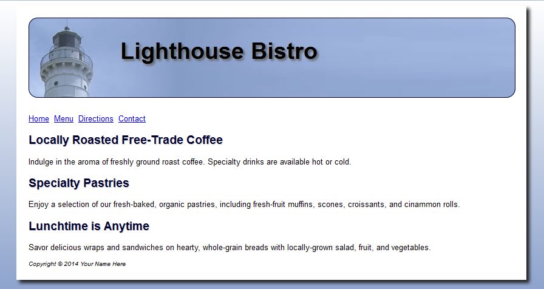

Lighthouse Example-
working with a page container

1. Verify that you have an `index.html`  in the LightHouseStarter folder like this:

2. create a folder "css", create a file: "lighthouse.css" inside this folder.

3. transfer all embedded styles from index.html to a stylesheet file named `lighthouse.css` and
   add the link to the index.html file. Test.

4. create a folder "images" and transfer all image files into this folder. 
   Adjust all references to these files to the new location.
   
   **Hint**: When you are using the below links, focus on what's between the curly braces as the information you need. You will most likely have a different selector that you are applying your styles here. 

5. Create an h1 style definition. Add the [background image](https://www.w3schools.com/cssref/pr_background-image.asp) file "lighthouselogo.jpg" 
   to the h1 style definition. Set the height to 100px and the [width](https://www.w3schools.com/cssref/pr_dim_width.asp) to 700px. 
   Set the font size to [3 times](https://www.w3schools.com/cssref/pr_font_font-size.asp) the default size.

6. Adjust the h1 style by adding left [padding](https://www.w3schools.com/css/css_padding.asp) of 150px and padding to the top of 30px.

7. Now let's give your header a rounded border. Add a [border](https://www.w3schools.com/css/css_border.asp) of 2px solid; and a [border-radius](https://www.w3schools.com/cssref/css3_pr_border-radius.asp) of 15px to the h1 style definition.

8. Add the background image file "background.jpg" to the body style definition.

9. We want to wrap the entire page content in a container to separate it from
   the background. Create a style definition id called "container" with these 
   style rules:

  - center the container horizontally by setting the right and left [margin](https://www.w3schools.com/css/css_margin.asp) to auto.
  - apply a fixed [width](https://www.w3schools.com/cssref/pr_dim_width.asp) of 850px;
  - apply 0 padding to the top, 20px to the right and left, and 10px to the bottom.
  - make the background color white
  - apply the [box-shadow](https://www.w3schools.com/cssref/css3_pr_box-shadow.asp) property with horizontal and vertical offset of 5px, blur radius of 5px,
    and color #1e1e1e.

10. In the index.html page, create a div that references the container style definition and wraps the entire page content. Your div should go on the inside of your body tags. 

11. Modify the h1 style definition by adding a [text-shadow](https://www.w3schools.com/cssref/css3_pr_text-shadow.asp) property with horizontal and vertical offset of 3px, 
    blur radius of 3px, and color #666666.

12. Modify the h2 style definition by adding a text-shadow property with horizontal and vertical offset of 1px, 
    no blur radius, and color #cccccc.

13. Compare with the image lighthouseResult.png.

You are now ready for the [Part 4 Challenge](../part4Challenge)
